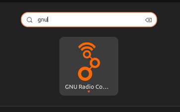

# GNU Radio Installaton

GNU Radio is a free & open-source software development toolkit that provides signal processing blocks to implement software defined radios.  
It can be used with readily-available low-cost external RF hardware to create software-defined radios, or without hardware in a simulation-like environment.  
It is widely used in research, industry, academia, government, and hobbyist environments to support both wireless communications research and real-world radio systems.
 

[Source: GNU Radio - About Page](https://www.gnuradio.org/about/)

GNU Radio is primarily a Linux based application, so can be used on a range of devices from laptops to Raspberry Pi’s.   
There is also a Windows installer available, although this runs the software within a linux based VM. 
Installation instructions can change with OS updates, so please follow instructions for your chosen OS using the official GNU Radio WiKi:
 

[GNU Radio WiKi - Installation](https://wiki.gnuradio.org/index.php/InstallingGR)

 
Once installed, select Show Applications in whichever OS you are using and type ‘GNU’. 
The app should look as follows:
 

