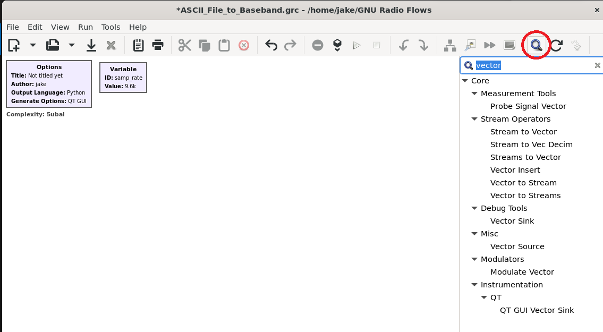

# Source and Sink Blocks Overview
Sink and Source blocks in GNU Radio act as the data input and output of a GNU Radio flow graph. 
Each block can usually produce or consume multiple data types

The most common Sink and Source block catagories are: 
* File Source/Sink
* Signal Source/Sink
* Audio Source/Sink

## 
Depending on the specific block, Sink and Source blocks can act as an interface for an SDR like the HackRF, ADALM-Pluto or LimeSDR, allowing you to receive and send signals to the SDR's Rx and Tx channels. 
Other types of source blocks can act as simulated signal (ie. sine wave, cosine wave, )

>Note. If you're looking for a particular block, click the magnifying glass icon in the top bar of GNU Radio and type the name of the block or a key word that could be associated with it. All associated blocks will display in the now expanded nested list to the right of the GUI. (See image below for example) 
